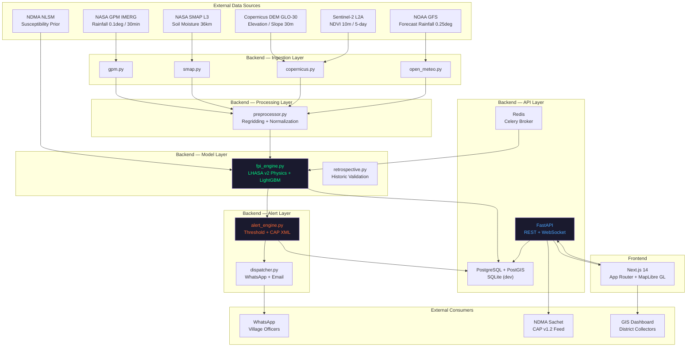
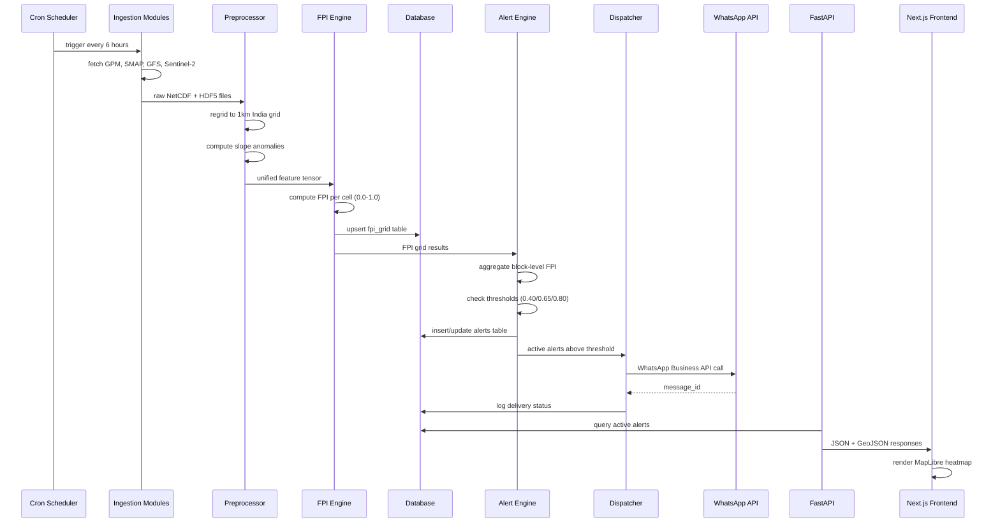
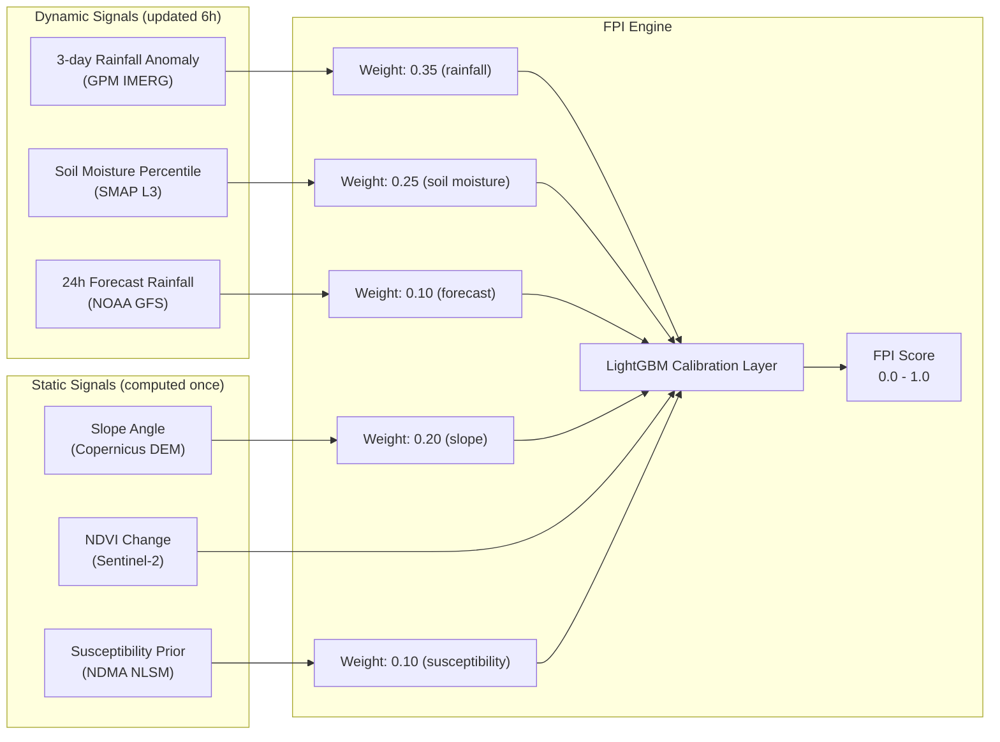
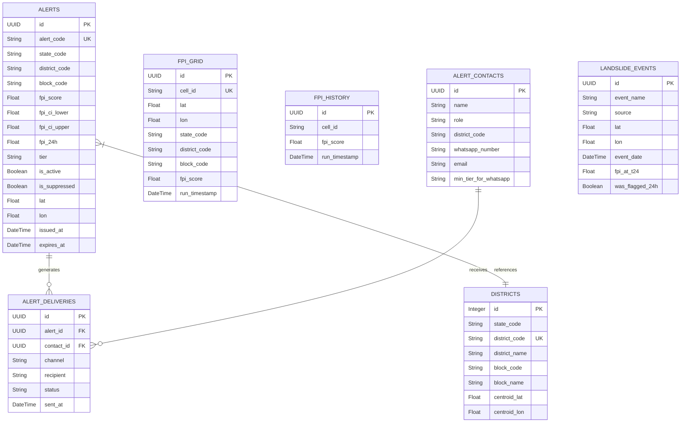
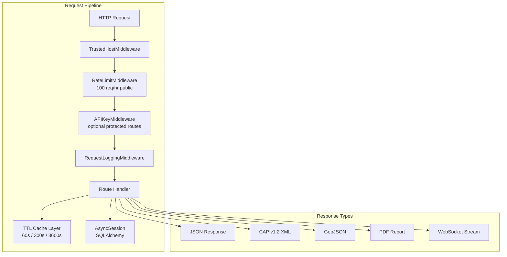
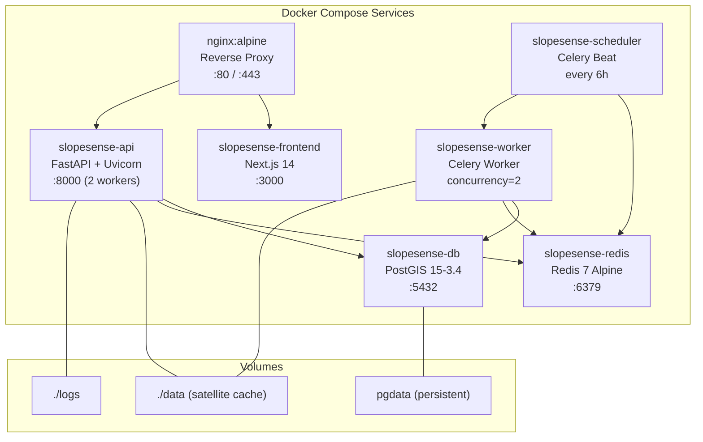

# SlopeSense — System Architecture

This document describes the end-to-end technical architecture of the SlopeSense platform, covering data ingestion, model computation, API serving, and alert dispatch.

---

## 1. High-Level System Overview



---

## 2. Data Flow — Step by Step



---

## 3. FPI Computation Model

The **Failure Probability Index (FPI)** is derived from NASA's LHASA v2 model, calibrated for Indian sub-continent conditions.

### Signal Weights



### Alert Threshold Logic

```
FPI Score ≥ 0.80  →  EMERGENCY  (consecutive cycles: 1)
FPI Score ≥ 0.65  →  WARNING    (consecutive cycles: 2)
FPI Score ≥ 0.40  →  WATCH      (consecutive cycles: 2)
FPI Score < 0.40  →  NORMAL     (no alert)

Suppression rule: if CI_upper - CI_lower > 0.30, tier → MONITORING
Spatial rule: ≥30% of cells in a block must breach threshold
```

---

## 4. Database Schema



---

## 5. API Layer Architecture



---

## 6. Infrastructure / Deployment



---

## 7. Tech Stack Summary

| Layer | Technology | Version | Purpose |
|-------|-----------|---------|---------|
| **Backend Framework** | FastAPI | 0.111 | REST API + WebSocket |
| **Async ORM** | SQLAlchemy | 2.0 | Database access |
| **Database (prod)** | PostgreSQL + PostGIS | 15.x | Geospatial queries |
| **Database (dev/test)** | SQLite + aiosqlite | — | Local development |
| **Migrations** | Alembic | 1.13 | Schema versioning |
| **Task Queue** | Celery + Redis | 5.4 | Async model runs |
| **ML Calibration** | LightGBM | 4.3 | FPI score calibration |
| **Geospatial** | GeoAlchemy2, Shapely, rasterio | — | Spatial data handling |
| **Frontend** | Next.js 14 (App Router) | 14.x | Dashboard UI |
| **Map Rendering** | MapLibre GL JS | — | GIS visualization |
| **Styling** | Tailwind CSS | — | UI design system |
| **Containerization** | Docker + Compose | 24 | Service orchestration |
| **Reverse Proxy** | Nginx | alpine | TLS, routing, static |
| **Monitoring** | Prometheus + Grafana | — | Metrics and alerting |
| **Testing** | Pytest + pytest-asyncio | 8.2 | Backend test suite |
