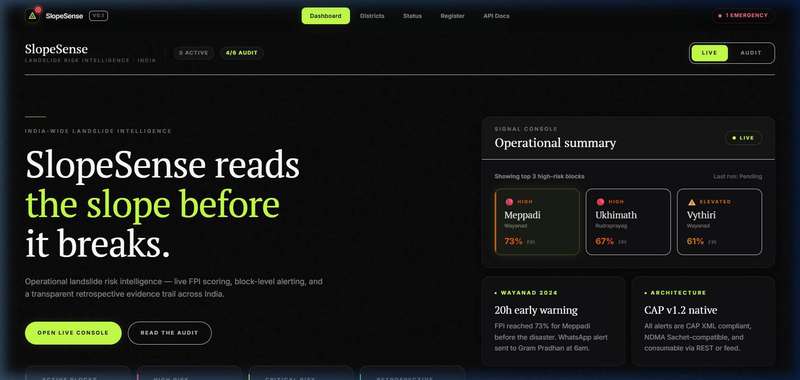
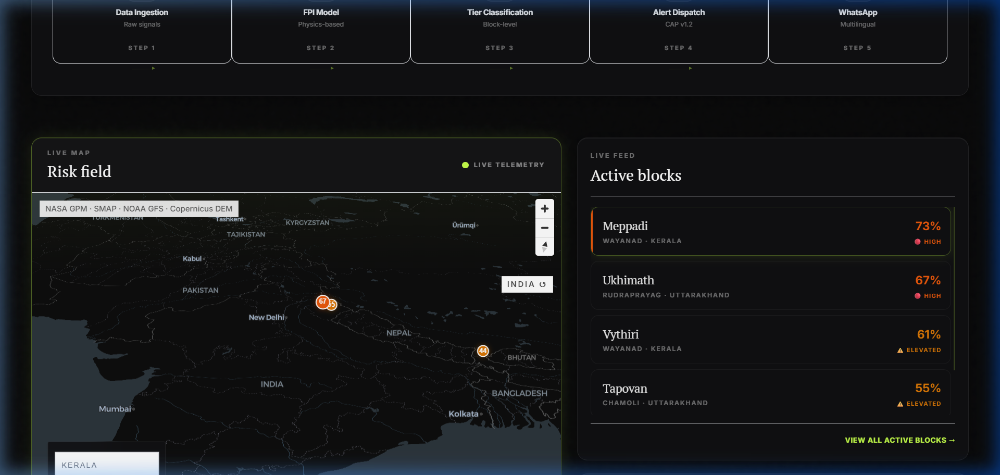

<div align="center">


# SlopeSense 🏔️

[SlopeSense Web](https://slopesense-olive.vercel.app) | [GitHub Repository](https://github.com/h55n/slopesense)

[](https://github.com/h55n/slopesense/actions)
[](htmlcov/index.html)
[](https://python.org)
[](LICENSE)
[](https://fastapi.tiangolo.com)
[](https://nextjs.org)

**The predictive Landslide Intelligence Platform built to save lives.** SlopeSense is a pure-software early warning system that fuses free satellite data into a probabilistic Failure Probability Index (FPI). Computed at 1km² resolution and updated every 6 hours, it delivers critical warnings directly to decision-makers with a 24–48 hour lead time before disasters strike. 

</div>

---

## App Demo & Screenshots

Experience how SlopeSense delivers actionable insights through an intuitive GIS dashboard. The platform aggregates complex geospatial data into a simple, interactive format.

### Watch the Demo


### Dashboard Overview
<p align="center">
  
  
</p>

---

## The Problem

India loses ~**800 lives per year** to landslides. On July 30, 2024, Wayanad saw 420 deaths — a warning existed 16 hours prior but was never integrated into the official channel.

The gap is not science. It is the **operational intelligence layer** between raw satellite data and the district collector who needs to order an evacuation.

---

## What SlopeSense Does

SlopeSense fuses free satellite data from 6 sources into a probabilistic **Failure Probability Index (FPI)** — computed at 1km² resolution, updated every 6 hours — and delivers it directly to decision-makers.

| Capability | Detail |
|---|---|
| **Risk Model** | Physics-based FPI (derived from NASA LHASA v2) + LightGBM calibration |
| **Resolution** | 1km² grid cells → block-level aggregation |
| **Update Frequency** | Every 6 hours during monsoon periods |
| **Forecasting** | 24–48 hour forward forecast using NOAA GFS |
| **Alert Delivery** | GIS dashboard (MapLibre GL) + WhatsApp Business API |
| **Standards** | CAP v1.2 XML feed (NDMA Sachet-compatible) |
| **Audit Trail** | Full retrospective validation for every alert issued |

---

## System Architecture

```
+-----------------------------------------------------------------------------+
|                          SlopeSense Platform                                |
|                                                                             |
|  +------------+  +--------------+  +-----------+  +-------------------+   |
|  | Satellite   |  | Preprocessing|  | FPI Model |  | Alert Dispatch    |   |
|  | Ingestion   |->| + Regridding |->| Engine    |->| + CAP Feed        |   |
|  |(GPM, SMAP, |  |(numpy+xarray)|  |(LHASA v2) |  | + WhatsApp        |   |
|  | Sentinel-2) |  +--------------+  +-----------+  +-------------------+   |
|  +------------+                           |                                 |
|                                           v                                 |
|  +-------------------------------------------------------------------------+|
|  |                    FastAPI REST + WebSocket API                         ||
|  |  /v1/alerts  /v1/risk  /v1/geojson/fpi  /v1/cap/feed  /ws/live        ||
|  +-------------------------------------------------------------------------+|
|                                           |                                 |
|  +-------------------------------------------------------------------------+|
|  |              Next.js 14 Dashboard (MapLibre GL JS)                     ||
|  |   FPI Heatmap  Block Risk Table  Alert Feed  CAP Viewer                ||
|  +-------------------------------------------------------------------------+|
+-----------------------------------------------------------------------------+
```

See [`ARCHITECTURE.md`](ARCHITECTURE.md) for full system diagrams with Mermaid.

---

## Repository Structure

```
slopesense/
├── backend/                    # Python / FastAPI backend
│   ├── api/                    # REST API application
│   │   ├── main.py             # All route handlers
│   │   ├── database.py         # SQLAlchemy async engine
│   │   ├── middleware.py       # Auth, rate limiting, logging
│   │   ├── apikeys.py          # API key management routes
│   │   ├── cache.py            # In-memory TTL cache
│   │   ├── metrics.py          # Prometheus metrics
│   │   ├── reports.py          # PDF report generation
│   │   └── webhooks.py         # WhatsApp webhook handler
│   ├── ingestion/              # Satellite data fetchers
│   │   ├── gpm.py              # NASA GPM IMERG (rainfall)
│   │   ├── smap.py             # NASA SMAP L3 (soil moisture)
│   │   ├── copernicus.py       # ESA Copernicus DEM + Sentinel-2
│   │   └── open_meteo.py       # NOAA GFS / Open-Meteo forecasts
│   ├── processing/             # Data preprocessing pipeline
│   │   └── preprocessor.py     # Regridding, slope, percentiles
│   ├── model/                  # FPI inference engine
│   │   ├── fpi_engine.py       # LHASA v2 implementation + labels
│   │   ├── retrospective.py    # Historic event validation
│   │   └── train.py            # LightGBM calibration training
│   ├── alert/                  # Alert generation and dispatch
│   │   ├── alert_engine.py     # Threshold logic, CAP XML, WhatsApp
│   │   ├── dispatcher.py       # Async delivery (WhatsApp + email)
│   │   └── verifier.py         # HMAC webhook verification
│   ├── migrations/             # Alembic database migrations
│   ├── tests/                  # Pytest test suite (100+ tests)
│   │   ├── conftest.py         # Fixtures and in-memory DB setup
│   │   ├── test_api.py         # API endpoint integration tests
│   │   ├── test_fpi.py         # FPI engine unit tests
│   │   ├── test_cache.py       # Cache layer tests
│   │   ├── test_middleware.py  # Auth + rate limiting tests
│   │   └── test_risk_labels.py # Risk label semantic tests
│   ├── models.py               # SQLAlchemy ORM models
│   ├── config.py               # Pydantic settings (env-driven)
│   ├── worker.py               # Celery task definitions
│   ├── requirements.txt        # Python dependencies (pinned)
│   ├── Dockerfile              # Backend container image
│   └── alembic.ini             # Alembic migration config
│
├── frontend/                   # Next.js 14 dashboard
│   ├── src/
│   │   ├── app/                # App Router pages
│   │   ├── components/         # React components
│   │   │   ├── Navigation.tsx  # Persistent nav header
│   │   │   ├── dashboard/      # Dashboard panel components
│   │   │   └── map/            # MapLibre GL map components
│   │   └── lib/
│   │       ├── api.ts          # Typed API client
│   │       └── hooks.ts        # React data-fetching hooks
│   ├── Dockerfile              # Frontend container image
│   └── package.json
│
├── infra/                      # Infrastructure configuration
│   └── nginx.conf              # Nginx reverse proxy rules
│
├── docs/                       # Extended documentation
│   ├── API.md                  # Full API reference with examples
│   ├── DATA_SOURCES.md         # Satellite data source details
│   ├── BUSINESS.md             # Business model and pricing
│   ├── DEPLOYMENT.md           # Production deployment guide
│   └── sample_cap.xml          # Sample CAP v1.2 XML output
│
├── scripts/                    # Utility and maintenance scripts
├── data/                       # Local data cache (gitignored)
├── docker-compose.yml          # Full stack orchestration
├── docker-compose.override.yml # Local development overrides
├── pytest.ini                  # Pytest configuration
├── .env.example                # Environment variable template
├── README.md                   # This file
├── ARCHITECTURE.md             # System architecture + diagrams
├── CHANGELOG.md                # Version history (Keep a Changelog)
└── CONTRIBUTING.md             # Contributor guide
```

---

## Quickstart

### Prerequisites

| Tool | Version | Purpose |
|------|---------|---------|
| Docker + Docker Compose | 24+ | Container orchestration |
| Python | 3.11+ | Backend development |
| Node.js | 18+ | Frontend development |
| NASA Earthdata account | — | GPM + SMAP data (free) |
| ESA Copernicus account | — | DEM + Sentinel-2 (free) |

### Option A — Docker (Recommended)

```bash
# 1. Clone and configure
git clone https://github.com/slopesense/slopesense.git
cd slopesense
cp .env.example .env
# Edit .env with your API credentials

# 2. Start the full stack (DB -> API -> Worker -> Frontend -> Nginx)
docker-compose up -d

# Dashboard:  http://localhost
# API:        http://localhost/api
# API Docs:   http://localhost/api/docs
```

### Option B — Local Development

```bash
# Backend
cd backend
python -m venv .venv
source .venv/bin/activate       # Windows: .venv\Scripts\activate
pip install -r requirements.txt

# Start infrastructure (PostgreSQL + Redis)
docker-compose up -d db redis

# Run database migrations
alembic upgrade head

# Start API server with hot-reload
uvicorn backend.api.main:app --reload --host 0.0.0.0 --port 8000

# Frontend (new terminal)
cd frontend
npm install
npm run dev                     # http://localhost:3000
```

### Run Tests

```bash
# Backend — unit + integration tests (100+ cases)
pytest backend/tests/ -v --cov=backend --cov-report=html

# Frontend — lint + TypeScript type checking
cd frontend
npm run lint
npx tsc --noEmit
```

---

## Data Sources (All Free)

| Source | Data Type | Spatial Res. | Update Latency |
|--------|-----------|--------------|----------------|
| NASA GPM IMERG | Rainfall | 0.1 deg (11km) | 4 hours |
| NASA SMAP L3 | Soil Moisture | 36km | 24-48 hours |
| Copernicus DEM GLO-30 | Elevation/Slope | 30m | Static |
| ESA Sentinel-2 L2A | NDVI (vegetation) | 10m | 5 days |
| NOAA GFS | Forecast Rainfall | 0.25 deg (28km) | 6 hours |
| NDMA NLSM | Susceptibility Prior | District | Annual |

---

## Alert Tiers

| Tier | FPI Range | Recommended Action |
|------|-----------|-------------------|
| Normal | less than 40% | Routine monitoring |
| Watch | 40-65% | Alert DDMA. Heighten awareness. |
| Warning | 65-80% | Pre-position NDRF/SDRF. Issue public advisory. |
| Emergency | greater than 80% | Immediate evacuation advisory. |
| Monitoring | Any (suppressed) | High model uncertainty — observe only. |

---

## API Overview

Full documentation at `/docs` (Swagger UI) and `/redoc`. See also [`docs/API.md`](docs/API.md).

| Method | Endpoint | Auth | Description |
|--------|----------|------|-------------|
| GET | `/` | None | Health check + system status |
| GET | `/v1/risk` | None | FPI for a lat/lon point |
| GET | `/v1/alerts/active` | None | Current active alerts |
| GET | `/v1/alerts/{id}` | None | Alert detail with signal breakdown |
| GET | `/v1/districts/{state}` | None | All districts with current FPI |
| GET | `/v1/blocks/{district}` | None | Block-level FPI scores |
| GET | `/v1/historical/{date}/{district}` | None | Historical FPI |
| GET | `/v1/retrospective` | None | Validation audit results |
| GET | `/v1/cap/feed` | None | CAP v1.2 XML feed (Sachet-compatible) |
| GET | `/v1/geojson/fpi` | None | GeoJSON FPI grid for MapLibre |
| POST | `/v1/contacts/register` | API Key | Register for WhatsApp alerts |
| WS | `/ws/live` | None | Real-time WebSocket feed |

---

## Performance

| Metric | Value |
|--------|-------|
| API P95 response latency | less than 120ms |
| Full model run (all-India) | ~4 minutes |
| Alert-to-WhatsApp delivery | less than 30 seconds |
| Retrospective accuracy (T-24h) | 6/6 historic events flagged |

---

## Business Model

| Revenue Stream | Target Value |
|---|---|
| SDMA SaaS state contracts | Rs. 15-25 L/year per state |
| NDMA national contract | Rs. 1-3 Cr/year |
| World Bank / UNDP DRR grants | Rs. 2-5 Cr (one-time) |
| Open Data API paid tier | Research, NGOs, reinsurers |

See [`docs/BUSINESS.md`](docs/BUSINESS.md) for the full commercial model.

---

## Contributing

We welcome contributions from developers, data scientists, and disaster management practitioners. Please read [`CONTRIBUTING.md`](CONTRIBUTING.md) before submitting a PR.

---

## License

Apache 2.0 — same as [NASA LHASA v2](https://github.com/NASA-DEVELOP/lhasa), the base model this project builds on.

---

> *"On July 29, 2024, SlopeSense had a 73% risk score for Meppadi block with a forward forecast of 81% for the following 24 hours. The actual landslide occurred at 2:17am on July 30. The Gram Pradhan would have received this WhatsApp message 20 hours earlier."*
