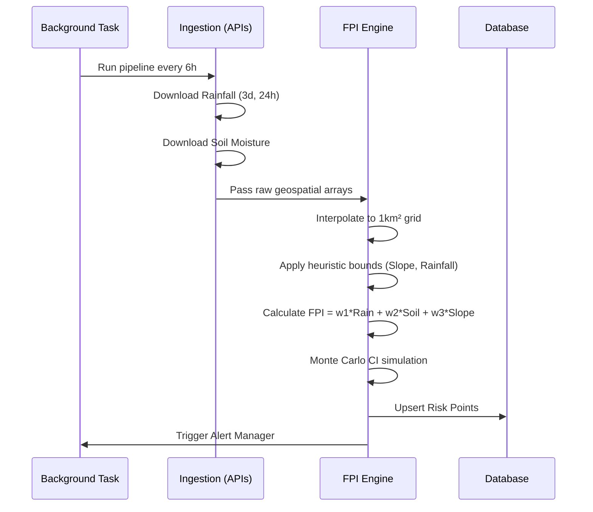
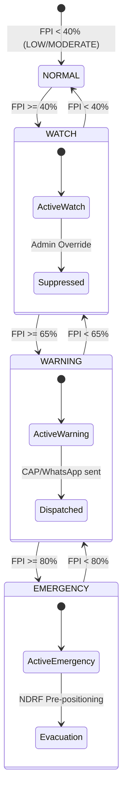
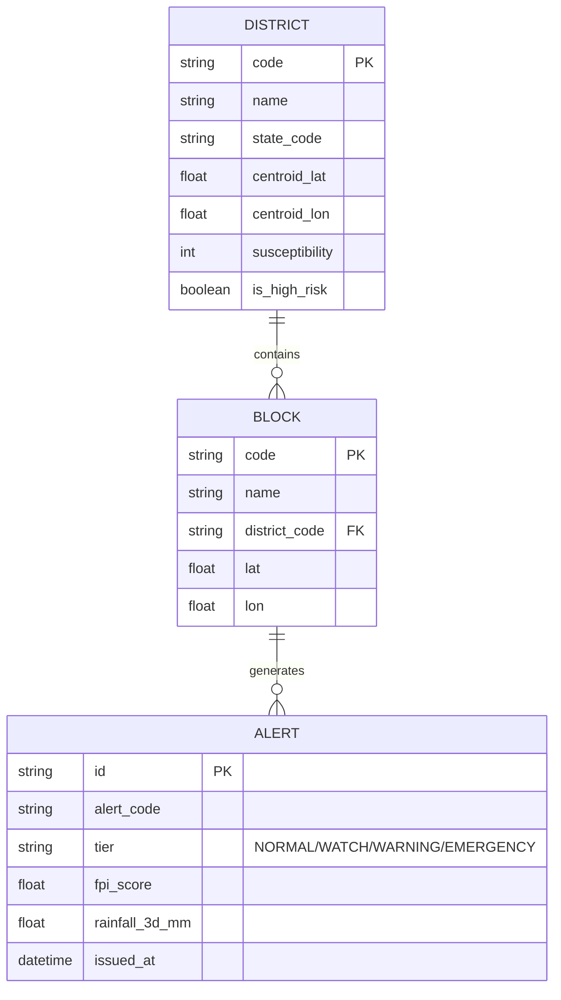

# SlopeSense System Architecture

SlopeSense is a real-time landslide risk intelligence platform for India. It integrates multi-source geospatial data (NASA GPM, SMAP, Copernicus DEM), computes a physics-based Failure Probability Index (FPI), and dispatches automated CAP-compliant alerts.

## 1. High-Level Architecture

```mermaid
graph TD
    %% External Data Sources
    subgraph Data Sources
        GPM[NASA GPM<br>Rainfall] --> Ing
        SMAP[NASA SMAP<br>Soil Moisture] --> Ing
        DEM[Copernicus DEM<br>Topography] --> Ing
        GFS[NOAA GFS<br>Forecast] --> Ing
    end

    %% SlopeSense Backend Core
    subgraph SlopeSense Backend (FastAPI + Async Python)
        Ing[Data Ingestion<br>fetch_pipeline.py] --> Pre[Preprocessor<br>FeatureGrid]
        Pre --> FPI[FPI Engine<br>Physics/ML Model]
        FPI --> Alert[Alert Manager<br>Threshold Evaluator]
    end

    %% Storage
    subgraph Storage Layer
        DB[(PostgreSQL / SQLite<br>+ Geo/Async)]
        Redis[(Redis<br>Cache & Rate Limiting)]
        Alert --> DB
    end

    %% External Interfaces
    subgraph Dispatch & Frontend
        Alert --> CAP[CAP v1.2 Feed<br>NDMA Sachet]
        Alert --> WA[WhatsApp Webhook<br>Twilio]
        API[FastAPI Endpoints] --> Next[Next.js Dashboard<br>Frontend]
        DB --> API
        Redis --> API
    end
```

## 2. FPI Model & Data Flow

The core of SlopeSense is the **Failure Probability Index (FPI)**. It fuses structural parameters with dynamic weather signals.



## 3. Alert Tiering System

Alerts are clustered into contiguous spatial blocks. If a block breaches safety thresholds, an active alert is created.



## 4. Database Schema



## 5. Deployment Setup

- **Frontend**: Vercel / Next.js Serverless
- **Backend API**: Dockerized FastAPI on AWS ECS / DigitalOcean App Platform
- **Database**: Amazon RDS PostgreSQL (PostGIS enabled)
- **Background Jobs**: AWS EventBridge / Celery beat
